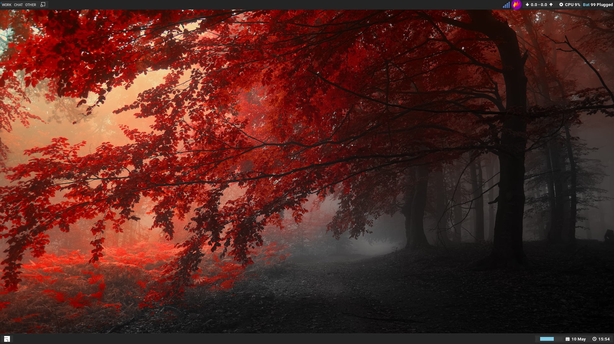

Awesome WM Copycats
===================

-------------------------
Themes for Awesome WM 4.x
-------------------------

:Author: Luca CPZ
:Version: git
:License: BY-NC-SA_
:Source: https://github.com/lcpz/awesome-copycats

Gallery
=======

**Holo**

Installation
============

.. code-block:: shell

    $ git clone --recursive https://github.com/elmeriniemela/awesome-copycats.git ~/.config/awesome-copycats
    $ ln -s ~/.config/awesome-copycats ~/.config/awesome
    $ sed -i '/HandlePowerKey/s/.*/HandlePowerKey=ignore/g' /etc/systemd/logind.conf
    $ sudo systemctl restart systemd-logind

